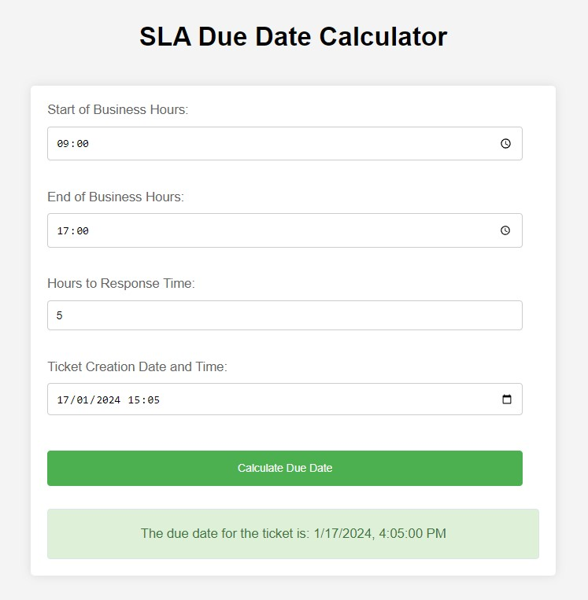

# Service_Level_Agreement_Calculator

## Description
The SLA Calculator is a JavaScript application designed to calculate the due date and time for a response to a service ticket, based on service level agreement (SLA) policies. It takes into consideration only the business hours from Monday to Friday and excludes weekends from the calculation.

## Features
- Input fields for start and end of business hours, SLA response time, and ticket creation date.
- Calculates due dates by excluding weekends and non-business hours.
- Simple and user-friendly interface.
  

## Setup
1. Clone the repository to your local machine.
2. Ensure that you have a modern web browser installed.
3. Open the `index.html` file in your web browser to start using the application.

## How to Use
1. Enter the start of business hours in the format (HH:MM AM/PM).
2. Enter the end of business hours in the format (HH:MM AM/PM).
3. Specify the SLA response time in hours.
4. Provide the ticket creation date and time.
5. Submit the form to view the calculated due date and time.

## Functions
- `calculateDueDate()`: The core function that takes in the form data and calculates the due date, skipping weekends and non-business hours.

## Example
- Start of business hours: 10:00 AM
- End of business hours: 6:00 PM
- SLA response time: 5 hours
- Ticket creation date: February 26, 2024, 2:00 PM

The expected output for the above inputs would be February 27, 2024, at 1:00 PM, considering the business hours.

## Contribution
Contributions to this project are welcome. Please fork the repository and submit a pull request.

## License
This project is licensed under the MIT License - see the LICENSE file for details.

